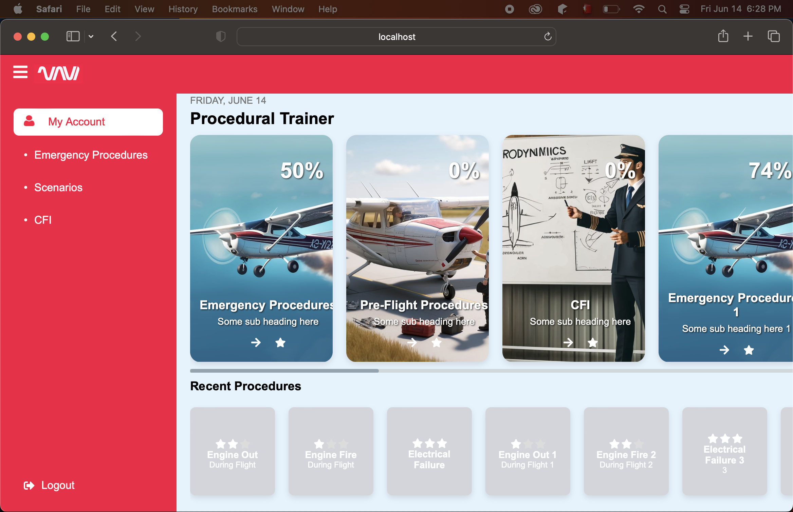

# navi

## Available Scripts

In the project directory, you can run:

### `npm start`

Runs the app in the development mode.\
Open [http://localhost:3000](http://localhost:3000) to view it in the browser.

The page will reload if you make edits.\
You will also see any lint errors in the console.

Problem Statement:

1. Side Menu:  We have a side menu on the left side that pops out and allows easy navigation between the different sections, this menu will slide in and out when the user clicks the button.

Done.

Slid in menu: 
 
Expanded Menu:
.

2. On the right we have the procedural trainer sections, this will eventually be about 20 sections, each with a % of completion assigned to it, this will dynamically be updated based on how many procedures the user has completed.

Done.

Procedural section view:
 

3. There is a sub section underneath that where we have the recent procedures the user has not scored 3 stars on yet and is able to quickly navigate to. This would scale to all started procedures.

Done. Also added horizontal scrolling for this.
 

4. When we mouse the various sections over them would be great to have a hover effect and raise them slightly, for touch this is not as important.

Done. Raised effect on hovering over prcedure card:
 

5. Once the user clicks into any of the procedural trainer sections they will arrive at the specific page which has all the steps. Once the first procedure is completed the next one will unlock, each of the procedures will have a 3 star rating and display the users score at the top. Once clicked it will show the brief of that page on the right side (this will always be whatever stage the user is on the first time its opened). Once they start the procedure it will take them to that procedure page.

6. When the user clicks on this, we want the button to call a function in a different file and not in the same App.js. You can have a placeholder file for now with a message returned.
The user will be able to scroll down and see all of the sections that are currently locked but will not be able to click them until they have completed the previous procedure.
7. The circle completion in the procedures page should correspond to percentage of completion and take that as input.

8. We ideally want the main menu to scale well vertically for the iPad and an iPhone in landscape orientation without having to zoom

